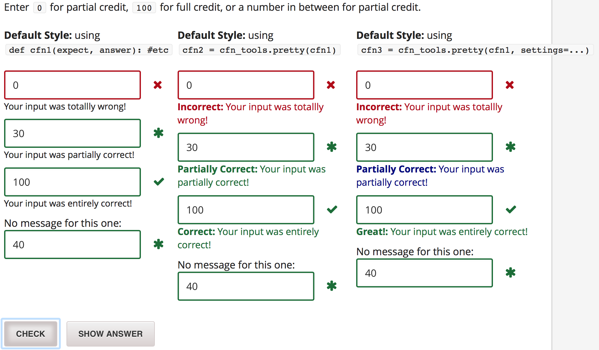

# cfn_tools
Helper tools to make check functions for edX customresponse problems. Two functions are included:

1. `pretty`, a decorator that formats customresponse feedback messages similarly to other edX feedback messages.
2. `debugger`, a simple check function that that displays the inputs passed to python. 

## Installation
*This installation is for edx.org or edge.edx.org. Installation on other instances of edX may be slightly different.*

If your course does not already have a `python_lib.zip` folder, upload `python_lib.zip` to your static directory. That's all.

**If your course already has a `python_lib.zip`** folder containing `other_module.py`, combine this `python_lib` and your `python_lib` to obtain a folder with structure

```
python_lib
    __init__.py
    cfn_tools.py
    other_module.py
```

In problem XML, import these python libraries as
```
import python_lib.cfn_tools as cfn_tools
import python_lib.other_module as other_module
```

##The Pretty Decorator

###Example


The decorator `cfn_tools.pretty` adds:
    
    -Correct / Partially Correct / Incorrect labels before feedback messages
    -Colors feedback messages according to correctness (the value of `'ok'` key)
    -Increases fontsize to 110% of normal for feedback messages.

Each of these is customizable.
###Usage
Zip `python_lib` and upload it to your course static directory. (Or add `cfn_tools.py` to an existing `python_lib`). Then import cfn_tools:

```
import python_lib.cfn_tools as cfn_tools
```

`cfn_tools.pretty` is a decorator function that maps an existing check function to a prettyfied verrsion:

```
pretty_cfn = cfn_tools.pretty(old_cfn)
```

###Settings
The decorator `cfn_tools.pretty` also accepts a `settings` keyword argument that can be used to specify the labels, colors, and fontsizes. The default settings are:

```
settings = {
        'fontsize':110,
        'correct' : {
            'label': 'Correct',
            'color': "#166e36"
        },
        'partially-correct' : {
            'label': 'Partially Correct',
            'color': "#166e36"
        },
        'incorrect' : {
            'label': 'Incorrect',
            'color': "#b20610"
        }
    }
```

You may specify some or all of these settings when applying `cfn_tools.pretty`. For example, the rightmost column in the screenshot above uses

```
pretty_settings = {
    'correct':{'label':"Great!"},
    'partially-correct':{'color':'navy'}
}
cfn3 = cfn_tools.pretty(cfn1, settings = pretty_settings)
```

This uses all of the default settings, except `correct` is labeled `"Great!"` `partially-correct` is colored `navy`.

##Debugger
`cfn_tools.debugger` is a simple check function for single- or multi-input `customresponse` problems that (1) grades every input as correct, and (2) displays what the python grader is seeing.

